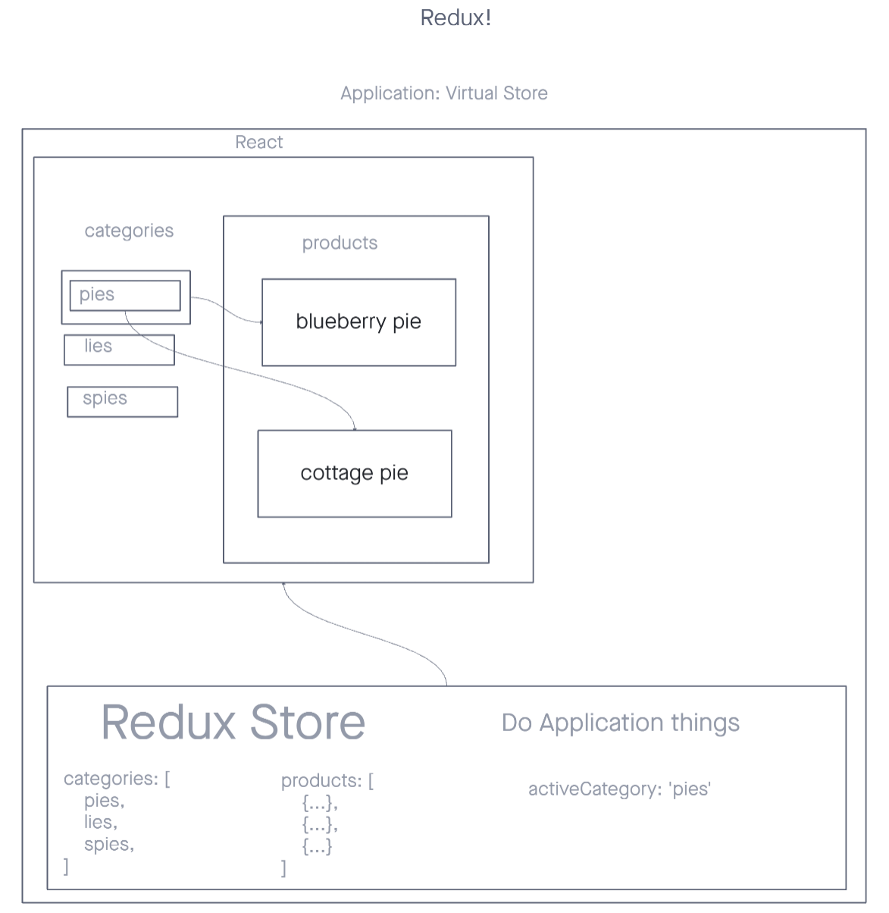

# Virtual Storefront

## Live Deploy

[Netlify](https://yamada-storefront.netlify.app/)

## Overview

A React frontend for virtual storefront application that would diplay items based on the category that the user selects. An introduction to Redux.

## Deployment

How do I install the app or library? 
Clone this app and install all dependencies. 
 

For Applications: 
How do I run the app? 
You can run the app on your local terminal. 
How do I set up the app? 
Be sure to install all dependencies. 

## Testing

No tests written
<!-- Run [nmp test] to run the tests.
- Tests that User should be able to send a request. -->

## Documentation

UML 

